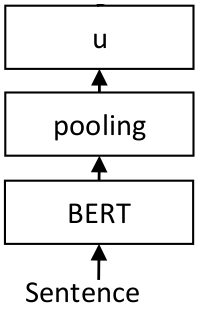

# Training Overview

Each task is unique, and having sentence / text embeddings tuned for that specific task greatly improves the performance.

SentenceTransformers was designed in such way that fine-tuning your own sentence / text embeddings models is easy. It provides most of the building blocks that you can stick together to tune embeddings for your specific task.

Sadly there is no single training strategy that works for all use-cases. Instead, which training strategy  to use greatly depends on your available data and on your target task.

In the **Training** section, I will discuss the fundamentals of training your own embedding models with SentenceTransformers. In the **Training Examples** section, I will provide examples how to tune embedding models for common real-world applications.

## Network Architecture

For sentence / text embeddings, we want to map a variable length input text to a fixed sized dense vector. The most basic network architecture we can use it the following:




We feed the input sentence or text into a transformer network like BERT. BERT produces contextualized word embeddings for all input tokens in our text. As we want a fixed-sized output representation (vector u), we need a pooling layer. Different pooling options are available, the most basic one is mean-pooling: We simply average all contextualized word embeddings BERT is giving us. This gives us a fixed 768 dimensional output vector independet how long our input text was.

The depicted architecture, consisting on a BERT layer and a pooling layer is one final SentenceTransformer model.

## Creating Networks from Scratch
 
 In the quick start & usage examples, we used pre-trained SentenceTransformer models that already come with e.g. a BERT layer and a pooling layer.
 
 But we can create the networks architectures from scratch by defining the individual layers. For example, the following code would create the depicted network architecture:
 
```python
from sentence_transformers import SentenceTransformer, models

word_embedding_model = models.Transformer('bert-base-uncased')
pooling_model = models.Pooling(word_embedding_model.get_word_embedding_dimension())

model = SentenceTransformer(modules=[word_embedding_model, pooling_model])
```

First we define our individual layers, in this case, we define 'bert-base-uncased' as the *word_embedding_model* and a (mean) pooling layer. We create a new *SentenceTransformer* model by calling `SentenceTransformer(modules=[word_embedding_model, pooling_model])`. For the *modules* parameter, we pass a list of layers which are executed consecutively. Input text are first passed to the first entry (*word_embedding_model*). The output is then passed to the second entry (*pooling_model*), which then returns our sentence embedding.

We can also construct more complex models:
```python
from sentence_transformers import SentenceTransformer, models
from torch import nn

word_embedding_model = models.Transformer('bert-base-uncased')
pooling_model = models.Pooling(word_embedding_model.get_word_embedding_dimension())
dense_model = models.Dense(in_features=pooling_model.get_sentence_embedding_dimension(), out_features=256, activation_function=nn.Tanh())

model = SentenceTransformer(modules=[word_embedding_model, pooling_model, dense_model])
```

Here, we add a fully connected dense layer with Tanh activation function on top of the pooling layer, that performs a down-project to 256. Hence, embeddings by this model will only have 256 dimensions.

[» Models Package Reference](../package_reference/models.md)

## Siamese Network Architectures
The fundametals are discussed in our research publication: [Sentence-BERT: Sentence Embeddings using Siamese BERT-Networks](https://arxiv.org/abs/1908.10084)

