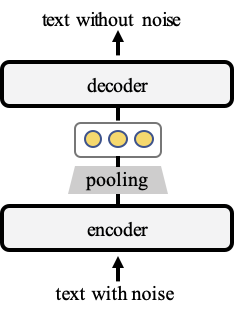

# Tranformer-based Denoising AutoEncoder (TSDAE)

This folder shows an example, how can we train an unsupervised [TSDAE (Tranformer-based Denoising AutoEncoder)](https://arxiv.org/abs/2104.06979) model with pure sentences as training data.

## Background 
During training, TSDAE encodes damaged sentences into fixed-sized vectors and requires the decoder to recon-struct  the  original  sentences  from  this  sentenceembeddings. For good reconstruction quality, thesemantics must be captured well in the sentenceembeddings from the encoder. Later, at inference,we only use the encoder for creating sentence embeddings. The architecture is illustrated in the figure below:



## Purely unsupervised training and evaluation on AskUbuntu
One can simply run this command to train and evaluate a TSDAE model on AskUbuntu without labels:

```python train_askubuntu_tsdae.py```

This can achieve around 0.60 test MAP score with only 16K unlabeled sentences.

## TSDAE as pre-training
With a few labeled pairs (e.g. 200), TSDAE can further boost the in-domain supervised performance. After the TSDAE unsupervised training, one can then run this command to also utilize labeled data:

```python train_askubuntu_tsdae_sbert.py```

## Citation
If you use the code for augmented sbert, feel free to cite our publication [TSDAE: Using Transformer-based Sequential Denoising Auto-Encoderfor Unsupervised Sentence Embedding Learning](https://arxiv.org/abs/2104.06979):
``` 
@article{wang-2021-TSDAE,
    title = "TSDAE: Using Transformer-based Sequential Denoising Auto-Encoderfor Unsupervised Sentence Embedding Learning",
    author = "Wang, Kexin andReimers, Nils and  Gurevych, Iryna", 
    journal= "arXiv preprint arXiv:2104.06979",
    month = "4",
    year = "2021",
    url = "https://arxiv.org/abs/2104.06979",
}
```